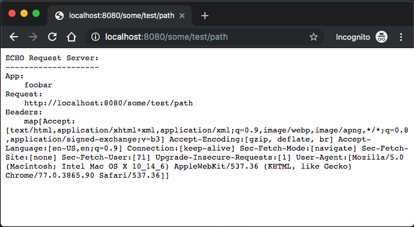

# echo-server
Simple echo server for demos

## Setup
- Args:
  - echotext: The text to specify in the "app" section of the request
  - response-delay: The delay to add to a http response (ex. `--response-delay=2s`)
  - listen-port: The port used to listen on (Defaults to 8080)
  
## Example

